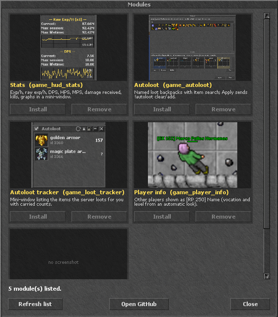

# pegaz-ots-mods

Client modules for the PegazOTS OTClientV8 client (protocol 8.6).



| Module | What it does |
|---|---|
| Stats | Exp/h, raw exp/h, DPS, HPS, MPS, damage received, kills, graphs in a mini-window |
| Autoloot | Named loot backpacks with item search; Apply sends `!autoloot clear` / `add` |
| Autoloot tracker | Mini-window listing the items the server loots for you with carried counts |
| Player info | Other players shown as `[RP 250] Name` (vocation and level from an automatic look) |
| Module installer | This installer: lists, installs, updates and removes the modules above without a restart |

Install with the in-game module installer (fetches `index.json` from this repo's Pages site), or by hand:
copy a `modules/<name>` folder into your client's `modules/` directory and restart the client.

`index.json` is generated by `tools/build_index.py` from `catalog.json` and the files on disk.

## Getting the installer

Paste this line into the client's Lua terminal (Ctrl+T) while logged in. It downloads the installer module
into the client's data directory and loads it, no restart. A `Modules` button appears in the top menu.

```lua
HTTP.getJSON("https://otc-mods.github.io/pegaz-ots-mods/index.json", function(d) for _, e in ipairs(d.entries) do if e.name == "game_module_installer" then local left = #e.files for _, f in ipairs(e.files) do HTTP.get(d.base .. f.path, function(data) local dir = "" for seg in f.path:gmatch("[^/]+") do if not seg:find("%.") then dir = dir .. "/" .. seg g_resources.makeDir(dir) end end g_resources.writeFileContents("/" .. f.path, data) left = left - 1 if left == 0 then g_modules.discoverModules() g_modules.ensureModuleLoaded("game_module_installer") print("Module installer ready") end end) end end end end)
```

Manual alternative: copy `modules/game_module_installer` into your client's `modules/` folder and restart the client.

## Screenshots

`screenshots/<module>.png` referenced from `catalog.json` (`"screenshot"` field) show up as thumbnails in the installer.
